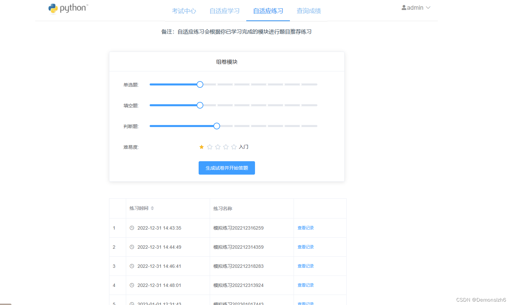
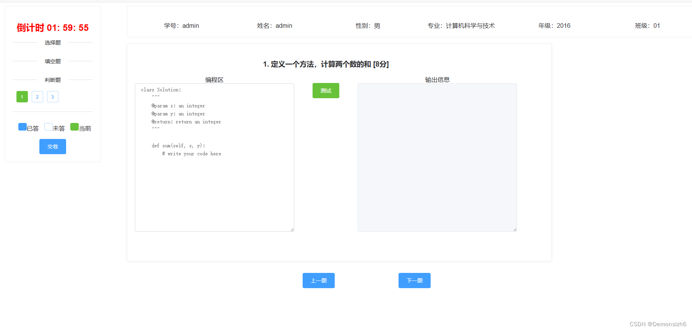
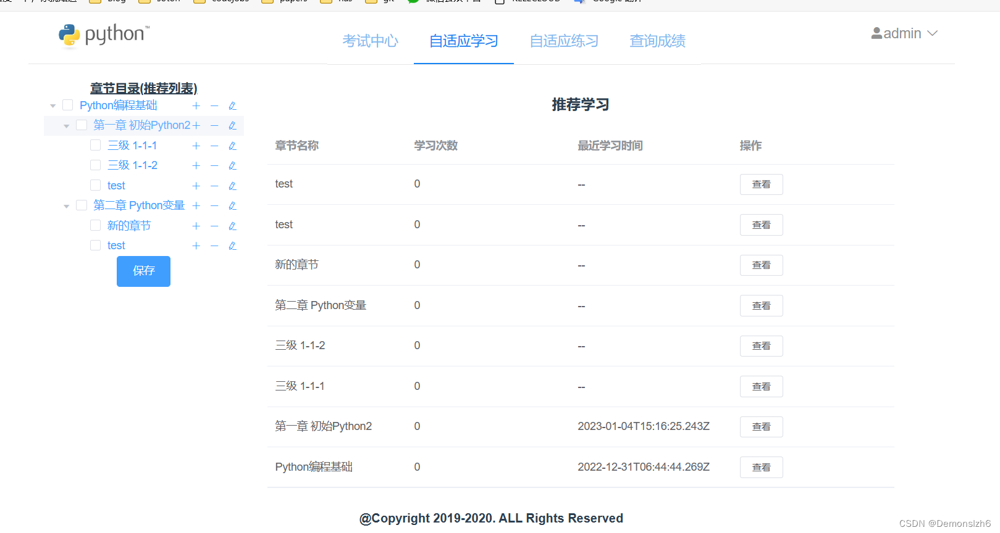
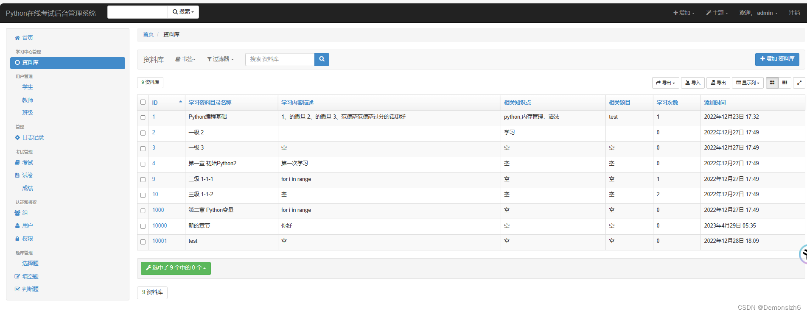

### 定制开发
需要毕业设计定制开发或者项目修改的同学可以微信扫描以下二维码联系我，我会根据你的需求进行开发。
咨询时请备注来源：Github    

# 自适应学习系统功能介绍

这个系统是一个基于Django框架的Python在线考试和学习平台。vue+django在线学习系统，在线考试系统。数据库使用dbsqlite,分为教师和用户角色，教师可以设置课程章节内容，设置考试题库，设置试卷难度供学生学习。可根据学生错题进行题目推荐。

## 分权分域
- **角色定义**: 系统内定义了多种用户角色，如学生、教师、管理员等，每种角色都有其特定的权限和操作范围。
- **权限管理**: 不同角色的用户被授予不同的权限，例如，教师可以创建和管理考试，而学生只能参加考试和查看自己的成绩。
- **域限制**: 用户的操作权限被限制在其特定的域内。例如，一个班级的教师只能管理属于该班级的学生和考试。

## 用户管理
- **用户注册（/api/register）**: 允许新用户在系统中注册。
- **学生管理（/api/students）**: 提供学生用户的相关操作。
- **修改密码（/api/update-pwd）**: 用户可以通过此接口修改自己的密码。

## 考试与练习管理
- **考试管理（/api/exams）**: 管理在线考试，包括考试的创建、配置和记录。
- **成绩管理（/api/grades）**: 提供查看和管理考试成绩的功能。
- **题目管理**:
  - 选择题（/api/choices）
  - 填空题（/api/fills）
  - 判断题（/api/judges）
  - 编程题（/api/programs）

## 练习记录管理
- **练习记录**:
  - 选择题记录（/api/records/choices）
  - 填空题记录（/api/records/fills）
  - 判断题记录（/api/records/judges）
  - 编程题记录（/api/records/programs）
  - 学习记录（/api/records/study）

## 学习内容管理
- **学习内容目录（/api/content/）**: 提供学习内容的目录查看。
- **章节学习内容（/api/learn/）**: 查看指定章节的学习内容。

## 其他功能
- **API文档（/api/docs/）**: 查看系统API的文档。
- **JSON Web Token认证（/api/jwt-auth/）**: 提供基于JWT的用户认证。
- **编程题检查（/api/check-program/）**: 用于编程题答案的自动检查。

## 管理界面
- **Xadmin（/api/xadmin/）**: 提供一个基于Django的管理界面，用于管理系统的各种资源。

